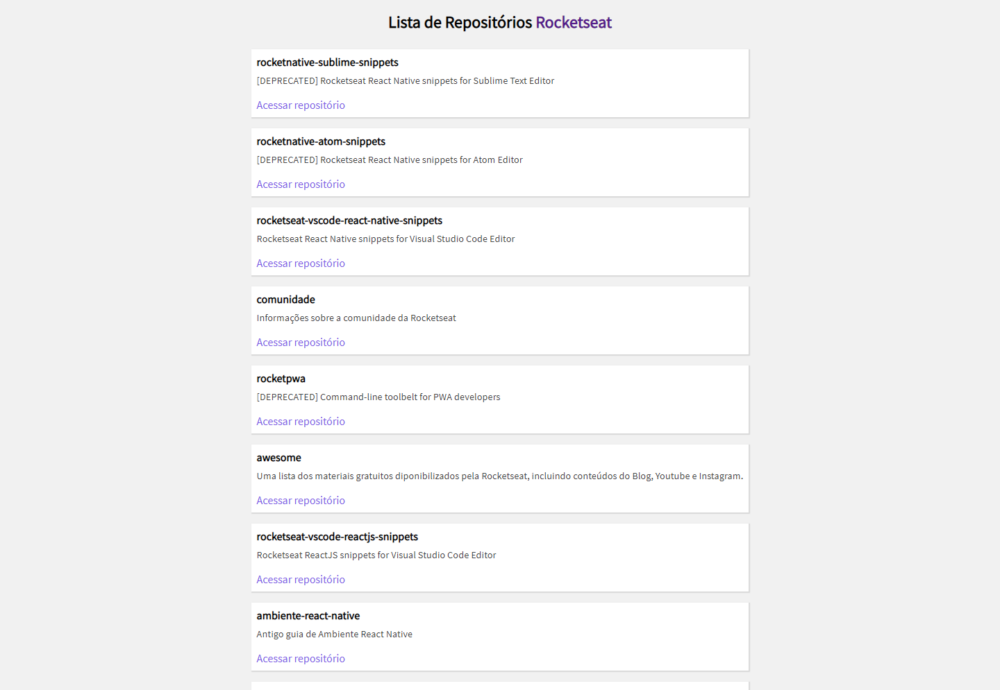

<h1 align="center">Github Explorer</h1>

<br>

## About

Application created in first module Ignite ReactJS by Rocketseat to teach React Fundamentals and introduce Typescript.

## Screenshot



## Features

This application request Github API and show all repositories by Rocketseat.

## Technologies

The following tools were used in this project:

- [React](https://reactjs.org/)
- [Yarn](https://yarnpkg.com/)
- [Sass](https://sass-lang.com/)
- [Webpack](https://webpack.js.org/)
- [Babel](https://babeljs.io/)
- [TypeScript](https://www.typescriptlang.org/)

## Requirements

Before starting :checkered_flag:, you need to have [Git](https://git-scm.com) and [Node](https://nodejs.org/en/) installed.

## Starting

```bash
# Clone this project
$ git clone https://github.com/davi1985/github-explorer

# Access
$ cd github-explorer

# Install dependencies
$ yarn

# Run the project
$ yarn start

# The server will initialize in the <http://localhost:3000>
```

## License

This project is under license from MIT. For more details, see the [LICENSE](LICENSE.md) file.

Made with :heart: by <a href="https://github.com/davi1985" target="_blank">Davi Silva</a>

&#xa0;

<a href="#top">Back to top</a>
